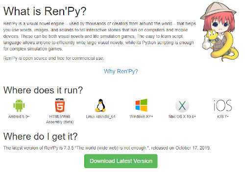
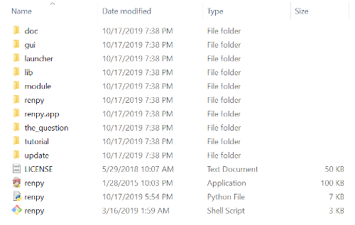
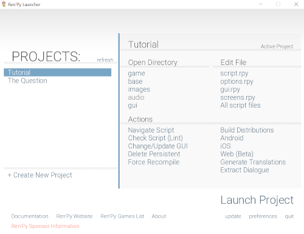
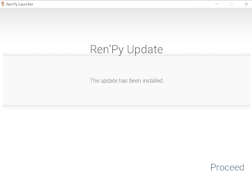
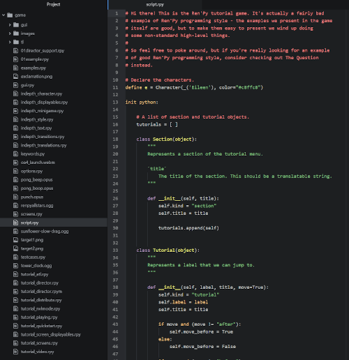

# Chapter 1: Downloading and Installing

- [Chapter 1: Downloading and Installing](#chapter-1-downloading-and-installing)
  - [Downloading](#downloading)
  - [Configuring Editors](#configuring-editors)

---

## Downloading

Ren'Py can be downloaded from its its Download ([Latest](https://www.renpy.org/latest.html)) page. It has builds for Windows, Mac, and Linux by default.(Additional, individual downloads for tools can be found under at the bottom of the same page.

Depending on the platform chosen, the downloaded file will need to be uncompressed into its full content of files. On Windows, this is done through its self-extracting file (7z). On Mac and Linux, it can be uncompressed either through the default file viewer or from command-line tools.

Navigating to the now uncompressed folder shows its contents. To run Ren'Py, open the "renpy" executable on Windows, "renpy" shell script in Linux, or the "renpy.app" on Mac.

The Ren'Py Launcher provides access to all of the files, directories, and possible actions for any project. By selecting projects on the left-hand side, they can be changed, built, or run.

## Configuring Editors

When *Tutorial* selected, click on the `script.rpy` file under "Edit File". This will prompt editor selection. The first three, Atom, Editra, and jEdit, are listed in order of size and functionality.

Choose Atom, the recommended editor for Ren'Py 7.0.

> **Note:** The Ren'Py Launcher will often check for updates during this step and automatically update itself before downloading the editor.

Once an editor is chosen, it will be downloaded, uncompressed, and configured for use with the Ren'Py Launcher. Depending on a number of factors like bandwidth and computer speed, this step may take some time.

Once ready, Ren'Py will prompt to "Proceed" to open `script.rpy` in the editor chosen and downloaded.

When opened, `script.rpy` can seem like a complicated collection of files and code. *Tutorial* is designed to show off the functionality of Ren'Py, not serve as a good code example. It can be closed using either File -> Exit or clicking on red 'X' in the upper, right-hand corner.

Return to the Ren'Py Launcher.

Ren'Py is now downloaded and configured for editing existing and new visual novels!
