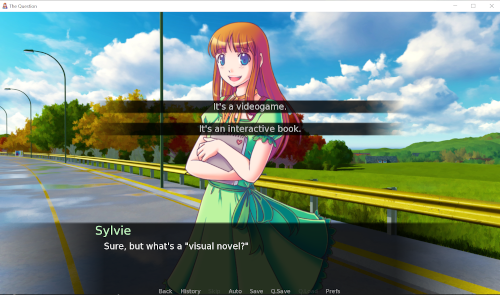

# Chapter 2: Understanding Narration

- [Chapter 2: Understanding Narration](#chapter-2-understanding-narration)
  - [Playing *The Question*](#playing-the-question)
    - [Main Menu](#main-menu)
    - [Playing a Visual Novel](#playing-a-visual-novel)
  - [Reviewing Python](#reviewing-python)
    - [Making Characters](#making-characters)
    - [*What about `_()`?*](#what-about-_)
    - [Name and Color](#name-and-color)
      - [Name](#name)
      - [Color](#color)
  - [Narration and Characters](#narration-and-characters)
    - [Narration](#narration)
    - [Characters](#characters)
  - [Reviewing Concepts](#reviewing-concepts)
    - [Ren'Py Terms](#renpy-terms)
    - [Programming Terms](#programming-terms)

---

## Playing *The Question*

Before trying to work through how Ren'Py structures code, at least one visual novel should be played to start to understand how they work and some common player expectations.

Open the Ren'Py Launcher.

With *The Question* selected under the PROJECTS listing, click on "Launcher Project".

### Main Menu


*The Question* begins with a menu showing the choices of "Start", "Load", "Preferences", "About", "Help" and "Quit".

**Most visual novels start with a menu**. Many visual novels projects can be quite complicated and take many sessions to play. To help players in making a decision to start a new session or continue an existing one, the options of "Start" and "Load" are provided.

Click on "Preferences".


The Preference screen shows different options for display, skipping, language, and volume settings. Many visual novels provide a similar screen.

Click on "Return" to return to the Start Menu.


### Playing a Visual Novel

Click on "Start".


Play in Ren'Py happens using *scenes*. The above screenshot shows an example of this. It has a background image with text overlaid on it. At the bottom of the screen are choices for shown on the Start Menu with a few additions.

> Ren'Py breaks up its visuals into *scenes*. These can be combinations of background and character images.

The text at the bottom of the screen is the *textbox*. It holds the *name* of the speaker and their *dialogue*. As will be shown during play and when examining code later in this chapter, all dialogue is "spoken" in Ren'Py.

Scenes are progressed through either left-clicking or pressing the SPACEBAR. Do so.


Taking at least one action will both progress the scene (show new text or images) and also enable the "Back" menu option at the bottom of the screen.

While not all visual novel provide the this functionality, *The Question* is an example of a visual novel where all actions can be "rewound" through clicking on the "Back" choice.

Click the "Back" choice.


*The Question* has now been rewound one action back to the first text. As there are no actions to rewind, the "Back" choice is now disabled.

Keep left-clicking or pressing SPACEBAR to progress the visual novel. Notice how, in most cases, only the text changes.

A new scene starts when the background changes.

Progress the visual novel more.


Stop when text appears in the middle of the screen. This is a *choice menu*.

> In Ren'Py, a *choice menu* presents one or more options to the player.

Click on "To ask her right away".


The character Sylvie is now speaking. The dialogue for this character appears below the name in the textbox.

Progress the visual novel.


Eventually, a new character will speak: me. Like when Sylvie was speaking, the textbox shows both the name of the speaker and their dialogue.

Progress the visual novel.



Soon, a second choice will be presented.

This time, instead of making a choice, click on "Save" in the bottom menu.


When presented with empty slots, choose the first one in the upper, left-hand corner.


When the icon changes, the current session has been saved. It shows what the current status of the screen was when the "Save" option was chosen and lists the day and time of the save file.

On the left-hand menu, click on "Main Menu".


Whenever at least one action has been taken, attempting to return to the Main Menu will prompt a confirmation stating any unsaved progress will be lost. (As the session was already saved, this can be ignored this time.)

Click on "Yes".


Back on the Main Menu, click on "Load" from the left menu.


The Load Screen shows any previously saved session. As there is now a save to select, click on the previously created save slot.


Play will immediately return to the previously saved point.

Click on "It's an interactive book."

Progress the visual novel.


Eventually, the visual novel will show the text "Good Ending". Progressing past this point will reset and move back to the Main Menu.

This is an example of an *ending*. Many visual novels have multiple endings. They are accessed through making different choices and then playing until an ending is reached. *The Question* has two ending: Good Ending and Bad Ending.


From the Main Menu, click on "Start" to reset the story. This time, a different choice will be made to see the other ending.


When the bottom menu appears, click on "Skip". This will fast-forward to the next choice.


This time, click on "To ask her later."

Progress the visual novel.


Eventually, the story will show the text "Bad Ending". This is the bad ending of the story.

Click to progress back to the Main Menu.

Click on either "Quit" or close the window.

## Reviewing Python

With *The Question* selected, click on `script.rpy` under "Edit File" in the Ren'Py Launcher.

The "Py" part of the Ren'Py comes from the programming language Python. When reading and writing code in Ren'Py, a version of Python code is used.

```Python
# Declare characters used by this game.
```

The very first line in the file is an example of a *comment*. In programming terminology, a comment is something written for other developers or as notes for an author. When the file is read by Ren'Py when running the project, *all comments are ignored*.

> A *comment* is written for other humans to explain the code near it. The computer ignores comments when it looks at the code. In Python, on which Ren'Py is based, comments start with a hash, `#`, and extend to the end of a line.

The first line explains what the initial few lines of the file are doing. In this case, they are "declaring characters used by this game."

```Python
define s = Character(_("Sylvie"), color="#c8ffc8")
define m = Character(_("Me"), color="#c8c8ff")
```

The next two lines setup the two characters with dialogue in *The Question*: Sylvie and Me.

The word `define` is a *keyword* in Ren'Py. It "defines" something as something else. In the case of the two lines of code, the keyword is being used to "define" two variables as characters in Ren'Py.

`s` and `m` are examples of *variables*. They hold values for later use in a program. In the case of the two lines, the variable `s` is the character Sylvie and the variable `m` is the character Me.

> A *variable* holds a value in programming. They have special rules of only using letters, numbers, and no special symbols other than the underscore. They **cannot** use spaces.

### Making Characters

The use of `Character()` is what is known as a *method* that is part of the **Character** object. In this case, it is *creating* a **Character** using two things: a name and a color.

> A *method* is like a is a small program that can accept data and produce some output. It accepts *arguments*, data passed to the method. It is part of an *object*, a way of organizing data in programming. In this case, **Character** is the object to which the method **Character()** is associated.

### *What about `_()`?*

The use of `_()` inside of **Character()** is a special *function* in Python.

> A *function* is a method that is *not* connected to an existing object.

It is used here as part of internationalization services. This is a complicated term for "supporting multiple languages." It is used to let Ren'Py know that anything inside of it may be translated into another language, if supported.

### Name and Color

The *name* and *color* used with **Character()** are examples of arguments. Using them tells the method which data it should work on when creating a **Character**.

#### Name

```Python
define s = Character(_("Sylvie"), color="#c8ffc8")
```

The *name* of the character is "Sylvie". It is an example of a **String**, a type of value enclosed in quotation marks. The value is `Sylvie`, and the quotation marks enclose the value.

The use of the quotation marks are important because variables cannot contain spaces. A string value, through using quotation marks, **can** use spaces. Any special characters can be used inside of the quotation marks.

> A **String** is any collection of letters, numbers, and special symbols enclosed in double-quotation marks.

#### Color

```Python
define s = Character(_("Sylvie"), color="#c8ffc8")
```

The *color* of the character is "#c8ffc8". It is another example of a **String**. It has opening and closing quotation marks.

Colors in Ren'Py are represented by hexadecimal numbers. They start with a hash, `#`, and have six numbers (0-9) and letters (a-f).

> The word *decimal* comes from "deci", meaning 10. *Hexadecimal numbers* are those based on "hexa" (six) plus "deci" (10). In other words, based on 16. Since there are billions of colors, they are represented in a shorthand the computer understands called "[hex triplet](https://en.wikipedia.org/wiki/Web_colors#Hex_triplet)."
>
> There are lots of resources for finding colors, but many image editing programs have [color wheels](https://en.wikipedia.org/wiki/Color_wheel) for selecting colors and seeing their hexadecimal form.

## Narration and Characters

### Narration

```Python
"It's only when I hear the sounds of shuffling feet and supplies being put away that I realize that the lecture's over."

"Professor Eileen's lectures are usually interesting, but today I just couldn't concentrate on it."

"I've had a lot of other thoughts on my mind...thoughts that culminate in a question."

"It's a question that I've been meaning to ask a certain someone."
```

Ignoring the next several lines of code and skip ahead to line 19. The above is an example of *narration*.

In Ren'Py, *narration* is any dialogue shown to the user that does not have a character associated with it. Narration is any description of the scene or other information given to the player.

> Narration appears in Ren'Py as a **String** value without a character to speak the line. It has opening and closing quotation marks enclosing it, but the quotation marks will not be shown to the player.

Like reading a story in a book, narration provides insight into the mind of the protagonist or establish the context of past or future dialogue. The use of "I" and mention of "classroom", for example, can begin to help put together that the character might be a student or teacher and that the lecture they attended is not finished.

### Characters

Skip down to lines 58-66.

```Python
s "Hi there! How was class?"

m "Good..."

"I can't bring myself to admit that it all went in one ear and out the other."

m "Are you going home now? Wanna walk back with me?"

s "Sure!"
```

Characters differ from more general narration in that they have one a name associated with their statements. In such cases, the variable for the character appears *before* what they are saying.

For example, when Sylvie is talking on line 58, it looks like the following:

```Python
s "Hi there! How was class?"
```

The variable, `s`, precedes the string to be spoken.

In another example, on line 60, the character Me speaks. On that line, the variable `m` appears before its line.

```Python
m "Good..."
```

In Ren'Py, what the player sees will be split up between narration and characters speaking. When a string appears by itself, it will be narration. When a character speaks, the variable representing that character will appear before the lines associated with it.

## Reviewing Concepts

### Ren'Py Terms

- **Scene**: a collection of images, both background and character, shown to a player.

- **Choice Menu**: One or more options for a player for to choose.

### Programming Terms

- **Comment**: Text written in code for human audiences. It is ignored by computers. In Python, comments start with a hash, `#`, and run to the end of a line.

- **Variable**: A container for data in programming. They can use letters, numbers, and the underscore. It cannot use any other special symbols like spaces.

- **Method**: A small program-like structure that can accept data and produce output. The data it accepts is called its arguments. Methods are part of objects and use either the object's name or some other detail when used.

- **Function**: is like a method, but is not associated with an object. It also accepts arguments.

- **String**: letters, numbers, or other special symbols contained within opening and closing double-quotation marks.

- **Hexadecimal Numbers**: A 16-based number system that used the numbers 0-9 and letters a-f to represent decimal numbers. They are commonly written as "hex triplets" where each pair of letters and numbers are the colors of red, green, and blue to represent billions of colors.
