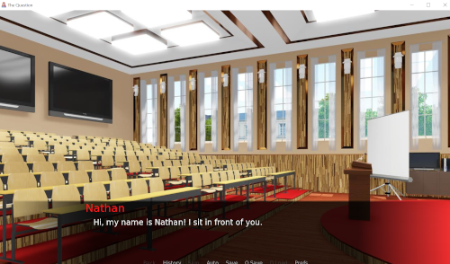

# Chapter 3: Editing and Creating Characters

- [Chapter 3: Editing and Creating Characters](#chapter-3-editing-and-creating-characters)
  - [Reviewing **Character()**](#reviewing-character)
  - [Editing Characters](#editing-characters)
    - [Refreshing a Script](#refreshing-a-script)
    - [Changing Colors](#changing-colors)
    - [Changing Narration](#changing-narration)
    - [Line Length Issues](#line-length-issues)
  - [Making A New Character](#making-a-new-character)
    - [Writing Characters](#writing-characters)
  - [Reviewing Concepts](#reviewing-concepts)

---

## Reviewing **Character()**

In a previous chapter, the method **Character()** was reviewed. In the example from *The Question*, the two characters looked like the following:

```Python
define s = Character(_("Sylvie"), color="#c8ffc8")
define m = Character(_("Me"), color="#c8c8ff")
```

The method **Character()** was passed two pieces of data: *name* and *color*. In the first line, the name was "Sylvie" and the color was "#c8ffc8".

> **Reminders:** Both *name* and *color* are **String** values. They are enclosed by opening and closing double-quotation marks.
>
> Colors in Ren'Py are also hexadecimal numbers. They are written in "hex triplet" format to represent a color.

## Editing Characters

In the Ren'Py Launcher, make sure *The Question* is selected and then click on "script.rpy" under Edit File. This will open the file in Atom.

As was shown above, the first three lines were the following:

```Python
# Declare characters used by this game.
define s = Character(_("Sylvie"), color="#c8ffc8")
define m = Character(_("Me"), color="#c8c8ff")
```

In the first line, change "Sylvie" to "Robin". It should now look like the following:

```Python
define s = Character(_("Robin"), color="#c8ffc8")
```

In Atom, save this change. Go to File -> Save or press CTRL+S (in Windows) or CMD+S (on MacOS X).

Leave Atom open and return to the Ren'Py Launcher.

Click on "Launch Project" in the Ren'Py Launcher. This will open the project.

On the Main Menu, click on "Start". Once the visual novel is running, click on "Skip" in the lower menu to fast-forward to the first choice menu. Pick "To ask her right away".


The name "Sylvie" was changed to "Robin" and the game now shows this change. All was changed was the name of the character and the game now reflects this.

Leave the visual novel running.

Return to Atom and now change the name to "Georgia". The line should look like the following:

```Python
define s = Character(_("Georgia"), color="#c8ffc8")
```

Save this change. Go to File -> Save or press CTRL+S (in Windows) or CMD+S (on MacOS X).

### Refreshing a Script

Having to stop and restart a visual novel to see a change could potentially be very annoying. As was already shown with seeing this change, multiple actions were needed to launch the project, fast-forward to the first choice menu, and then picking an option to see the change.

To help speed up this process, Ren'Py provides the ability to "refresh the script." In Ren'Py terms, this means that the file `script.rpy` will be reloaded and any changes applied immediately.

Currently, the file `script.rpy` has the previous name of the character. To fix this, press SHIFT+R.


With the script refreshed, the new name will be shown.

### Changing Colors

To change the name of the character, it was as easy as changing one value at the top of the script. Everything else continued to work exactly as before.

Adjusting the color of the character now named Georgia is the same. It can be accomplished through changing the *color* value.

This time, change the *color* value to "#ea4c16". The new line will look like the following:

```Python
define s = Character(_("Georgia"), color="#ea4c16")
```

> **Note:** Because SHIFT+R was used, Ren'Py has enabled auto-reloading of the file. It will now detect any changes and apply them immediately.

Save this change. Go to File -> Save or press CTRL+S (in Windows) or CMD+S (on MacOS X).

Once changed, the new color will show up in the visual novel because of the auto-reloading enabled by the previous use of SHIFT+R.


### Changing Narration

Changing existing characters is as easy as changing their name or color. As long they already exist in the project, these details can be updated easily.

Changing narration is just as easy.

Click on "Prefs" in the still-open window of *The Question*. This will open the preferences and also enable access back to the Main Menu.

Click on "Main Menu" to return to the main menu. (Ren'Py will warn that any unsaved progress will be lost. This is fine for testing purposes.)

Look at line 19:

```Python
"It's only when I hear the sounds of shuffling feet and supplies being put away that I realize that the lecture's over."
```

As was reviewed in the previous chapter, this is an example of *narration*. As it is not associated with a character, it is used to describe the scene or otherwise give information to the player. It is also an example of a **String** because it is enclosed in an opening and closing quotation marks.

Change the line to the following:

```Python
"Class always puts me to sleep and today was no exception."
```

Save this change. Go to File -> Save or press CTRL+S (in Windows) or CMD+S (on MacOS X).

In the running *The Question* window, click on "Start" to begin the visual novel again.


With auto-reloading still enabled by Ren'Py, the first line of the visual novel is now different.

Return to Atom. This time, a line of narration will be removed.

Look at lines 19-25:

```Python
"Class always puts me to sleep and today was no exception."

"Professor Eileen's lectures are usually interesting, but today I just couldn't concentrate on it."

"I've had a lot of other thoughts on my mind...thoughts that culminate in a question."

"It's a question that I've been meaning to ask a certain someone."
```

This time, remove line 21.

Save this change. Go to File -> Save or press CTRL+S (in Windows) or CMD+S (on MacOS X).

The previous code will now look like the following:

```Python
"Class always puts me to sleep and today was no exception."

"I've had a lot of other thoughts on my mind...thoughts that culminate in a question."

"It's a question that I've been meaning to ask a certain someone."
```

Back in the *The Question* window, progress the visual novel by one line through left-clicking or pressing SPACEBAR.

*The Question* will now show the new progression from the change line directly past the removed line in the script.

Changing narration is as simple as writing a new line or changing existing ones. As long as they are enclosed in quotation marks, Ren'Py will treat them as narration and show them to the player.

### Line Length Issues

Making changes in Atom and seeing those changes is really simple. Using the SHIFT+R auto-reloading in Ren'Py makes testing even easier.

While it may seem like any text could be used in Ren'Py, there is a small but important detail to remember. **The length of the dialogue affects its readability.** If the line of dialogue is particularly long, it will overrun the textbox.

Click on "Prefs" in the still-open window of *The Question*. This will open the preferences and also enable access back to the Main Menu.

Click on "Main Menu" to return to the main menu. (Ren'Py will warn that any unsaved progress will be lost. This is fine for testing purposes.)

Add the following long line before any other narration on line 19:

```Python
"Lorem ipsum dolor sit amet, consectetur adipiscing elit, sed do eiusmod tempor incididunt ut labore et dolore magna aliqua. Ut enim ad minim veniam, quis nostrud exercitation ullamco laboris nisi ut aliquip ex ea commodo consequat. Duis aute irure dolor in reprehenderit in voluptate velit esse cillum dolore eu fugiat nulla pariatur. Excepteur sint occaecat cupidatat non proident, sunt in culpa qui officia deserunt mollit anim id est laborum."

"Class always puts me to sleep and today was no exception."

"I've had a lot of other thoughts on my mind...thoughts that culminate in a question."
```

Restart *The Question* through clicking on "Start" frm the Main Menu. The new line 19 will be shown.


Notice that the new text *overflows* the textbox. Many of the words are now hidden by the menu at the bottom of the screen.

Generally, **a good number of words is 30 or less or around 200 characters**. Depending on the length of words, more might be possible, but for the best readability, around 30 words per line is a good measurement for most projects.

> **Note:** Changes can be undone through pressing CTRL-Z (in Windows) or CMD-Z (on MacOS X) in Atom. Pressing it can undo any changes made.

## Making A New Character

So far, only existing characters have been changed. Creating new characters and writing new dialogue is just as easy.

Click on "Prefs" in the still-open window of *The Question*. This will open the preferences and also enable access back to the Main Menu.

Click on "Main Menu" to return to the main menu. (Ren'Py will warn that any unsaved progress will be lost. This is fine for testing purposes.)

Return to Atom.

Add a new character:

```Python
# Declare characters used by this game.
define n = Character(_("Nathan"), color="#ff191c")
define s = Character(_("Georgia"), color="#ea4c16")
define m = Character(_("Me"), color="#c8c8ff")
```

New characters are created through using the keyword `define`, a variable name, and the **Character()** method. Previously, the existing characters were edited. Creating a new one requires only creating a new variable (using a name and the keyword `define`).

Return to *The Question*. It will have crashed.


While there are some changes the auto-reload can handle, **adding new characters is not one of them**. Click on "Quit" to close.

> **Note:** The Ren'Py auto-reloading can handle changes to existing characters, narration, and existing lines of dialogue. Adding new characters and other code changed that will influence the entire story will often crash the current project.

### Writing Characters

In the new code, the variable `n` now represents a new **Character** with the name of "Nathan" and uses the color "#ff191c".

As was shown earlier in this chapter, writing narration is a matter of writing new **String** values. Writing *character* dialogue is not much different. Instead of a **String** value, it needs the variable in front of it.

Change lines 20-24 to the following:

```Python
n "Hi, my name is Nathan! I sit in front of you."

"Class always puts me to sleep and today was no exception."

"I've had a lot of other thoughts on my mind...thoughts that culminate in a question."
```

In the Ren'Py Launcher, click on Launch Project.

Click on "Start" on the Main Menu.



## Reviewing Concepts

Characters are created through using the **Character()** method. It accepts two arguments, *name* and *color*. Both are **String** values.

Narration is created in Ren'Py through using more **String** values. Lines of dialogue can be added, edited, or removed.

For testing purposes, Ren'Py provides SHIFT+R to refresh the script. Changes made to narration, dialogue, or character name and colors will be reloaded. **Adding new characters while using the auto-reloading will crash the visual novel, however.**

New characters can be added through using the `define` keyword, a variable name, and the **Character()** method. Using the existing code, new characters can be created using the same structure with new variables.

Using new characters follow the same model as the existing ones found in *The Question*: they start with the variable representing the character and the line of dialogue they speak in the scene. They can be added to the script to show up before or after existing lines of narration or dialogue.
