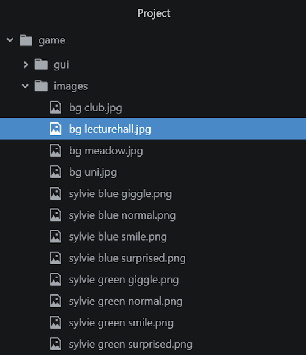

# Chapter 4: Scene Management

- [Chapter 4: Scene Management](#chapter-4-scene-management)
  - [Labels](#labels)
    - [Start Label](#start-label)
    - [Choice Menus](#choice-menus)
    - [Jumping](#jumping)
  - [Scenes](#scenes)
    - [`scene` Keyword](#scene-keyword)
    - [*Do filetypes matter?*](#do-filetypes-matter)
    - [Layers](#layers)
  - [Images](#images)
    - [`show` keyword](#show-keyword)
    - [Replacing Images](#replacing-images)
    - [`scene black`](#scene-black)
  - [`return`](#return)
  - [Reviewing Concepts](#reviewing-concepts)

---

## Labels

On an abstract level, visual novels are broken up into *scenes*. These are collections of images and text shown to a player. Internally, scenes are broken up into *labels*. These are different parts of the visual novel expressed in code.

> The keyword `label` breaks up a visual novel into different parts of code.

### Start Label

The most important label of a visual novel is the `start` label.

Open the Ren'Py Launcher. With *The Question* selected, click on "script.rpy" under Edit File. This will open the file in Atom.

Look at Lines 11-12:

```Python
# The game starts here.
label start:
```

As the comment explains, all visual novel projects start at `label start`. It is followed by a colon. Everything that follows this label is part of the `start` label.

> The `label start` is where all visual novels begin in Ren'Py.

Look at Lines 11-26:

```Python
# The game starts here.
label start:

  # Start by playing some music.
  play music "illurock.opus"

  scene bg lecturehall
  with fade

  n "Hi, my name is Nathan! I sit in front of you."

  "Class always puts me to sleep and today was no exception."

  "I've had a lot of other thoughts on my mind...thoughts that culminate in a question."

  "It's a question that I've been meaning to ask a certain someone."
```

Notice that the lines of narration are *under* the label `start`. In Ren'Py, narration and character dialogue that are "under" the label are spaced in using a TAB.

> **Note:** Python, on which Ren'Py is based, cares about *whitespace*. This includes spaces, tabs, and other forms of spacing. Everything "under" a label should be spaced by pressing TAB before the line.

Line 20, added in the previous chapter, shows the line of dialogue with a character variable and their dialogue.

> **Note:** Lines 17-18 will be covered later in this chapter. The `with` keyword is covered in a later chapter on screen languages.

### Choice Menus

Look at Lines 42-52:

```Python
menu:

  "As soon as she catches my eye, I decide..."

  "To ask her right away.":

    jump rightaway

  "To ask her later.":

  jump later
```

Menus are used to create *choice menus*. They start with the keyword `menu`. Unlike the above use of `label start`, menus are created using narration lines. For each line of narration, the menu will have a choice.

> In Ren'Py, the `menu` keyword is used to create choice menus.

Inside of a `menu`, the result of clicking on an option is "under" its narration like. Like with using labels, each menu option ends with a colon and then "under" it is what should happen.

### Jumping

Look at Lines 46-52:

```Python
"To ask her right away.":

  jump rightaway

"To ask her later.":

  jump later
```

To move to a different part of a visual novel, the keyword `jump` is used. It is used to "jump" to a different label. The part to move to follows the `jump` keyword.

> The `jump` keyword is used to move to a different label within a visual novel.

The jump keyword is used to move from one label to another. It “jumps” to that new section of code. It **must** exist or an error will occur.

## Scenes

Scenes are created through images and text. Internally, labels are used to divide up a visual novel.

In a previous chapter, narration and character dialogue was shown. Scenes, though, are also composed of images.

### `scene` Keyword

In Ren'Py, the use of the `scene` keyword clears the current images and replaces them with new ones. It primarily works with background images.

> The *scene* keyword creates new scenes through clearing all existing images and replacing them with an image found through the tag, "category", and attribute following the keyword usage.

Look at Lines 17-18 in *The Question*:

```Python
scene bg lecturehall
with fade
```

The `scene` keyword shows images based on its *tags* and *attributes*.

Look at Line 17:

```Python
scene bg lecturehall
```

It uses the keyword `scene` and is followed by its tags and attributes: "bg lecturehall". The tag is "bg" and the attribute is "lecturehall".

> In Ren'Py, *tags* and *attributes* are used to find images based on their names. Tags can be thought of as "categories" and attributes as specific images within those categories.

In *The Question*'s project folder, there is sub-directory called `images`.



When the `scene` keyword is used with tags and attributes, it will look for images that match them. For example, in the `scene bg lecturehall` line, Ren'Py will look for images in the `images` folder matching first any with the tag "bg" and then any with both "bg" *and* "lecturehall".


> **Note:** While Ren'Py does not enforce it, a good pattern for tag usage is to use "bg" as the tag for all background images.

### *Do filetypes matter?*

Ren'Py will attempt to display any images matching the tag and attributes used. Officially, [Ren'Py supports](https://www.renpy.org/doc/html/quickstart.html#images) JPG, JPEG, PNG, or WEBP files. However, it will remove the filetypes when looking for files using tags and attributes.

### Layers

Images are shown on *layers* in Ren'Py. The `scene` keyword, for example, replaces all images that are part of the *master* layer.

Ren'Py has the following layers:

- **Master**: background and character images
- **Transient**: user interactions functions
- **Screens**: screens and other system displays
- **Overlay**: user interface functions

> A *layer* is an abstraction for where different images and other displays can be shown to a player. Ren'Py has four layers for displaying content.

Usually, images are shown with the master layer. Unless part of a user interaction or created as part of a screen, images are shown and hidden from this layer.

## Images

Images are primarily shown using the `show` keyword. It works like the `scene` keyword, using tags and attributes, but does not replace all other existing images.

### `show` keyword

Look at Lines 28-34:

```Python
scene bg uni
with fade

"When we come out of the university, I spot her right away."

show sylvie green normal
with dissolve
```

After the usage of the keyword `scene` is another set of lines that begin with a different keyword, `show`.

The `scene` keyword replaces all current images on the master layer. The keyword `show` *adds* to the master layer, placing another image on it with any others. The keyword `show` is often used *after* `scene` to add a character to a visual scene.

> **Note:** The keyword `with` will be covered in another chapter on Ren'Py's screen language.

Look at Line 33:

```Python
show sylvie green normal
```

The keyword `show` works like `scene` was shown to do with tags and attributes.


> The `show` keyword shows an image, adding it to the current master layer. It works with tags and attributes to find an image in the `images` folder.

### Replacing Images

Compare Line 33 with Line 57:

Line 33:

```Python
show sylvie green normal
```


Line 57:

```Python
show sylvie green smile
```


The use of `show` *replaced* the image **using the same tag**. Because the tag and attribute combination "sylvie green" (normal) matches "sylvie green" (smile), the images are switched.

One of the advantages of using tags is because they will replace images when the keyword `show` is used.

### `scene black`

Consider Line 163 in *The Question*:

```Python
scene black
```

The keyword `black` here is a built-in image that is special in Ren'Py. (There is no file with the tag "black" in the `images` folder.)

When used together, `scene black` will remove all the existing images (as `scene` does) and show a black screen. The color `black` is the only built-in color of this type. It is used multiple times in *The Question* to show a visual change.

> The keywords `scene black` removes all other existing images on the master layer and shows a black screen as the replacement.

## `return`

Visual novels end when the keyword `return` is used in Ren'Py.

Consider Lines 237 and 254 in *The Question*:

```Python
return
```

When Ren'Py encounters the keyword `return`, it immediately "returns" the visual novel back to the Main Menu.

In other words, `return` is the last line of an ending. Nothing follows the use of the `return` keyword.

## Reviewing Concepts

Visual novels are broken up into *labels*. Everything inside of the label is "under it" (indented) through using the TAB key.

The keywords `label start` are special. This is where the visual novel starts.

When the keyword `menu` is used, it creates options for the player based on each line of narration within it.

To move between labels, the `jump` keyword is used. This "jumps" the story to the label following the use of the keyword.

The keyword `scene` clears all existing images and replaces them with an image found through using its tags and attributes. Very generally, a tag can be thought of as a "category" and an attribute as a specific entry within the category. Images are found in the `images` folder based on the name of the file as a combination of tags and attributes.

When the keyword `show` is used, it adds an image to the screen using tags and attributes. Multiple usages of `show` will replace a current image if it has the same tags but different attributes.

Ren'Py uses *layers* to organize what it displays. There are four layers with the layer *master* being where backgrounds and other images are normally shown.

The special keywords `scene black` removes all other images and replaces them with a single black image as the background.

The visual novel ends with the keyword `return` is used. This immediately "returns" the story back to the Main Menu.
