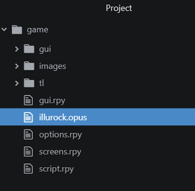

# Chapter 7: Audio

- [Chapter 7: Audio](#chapter-7-audio)
  - [`play` keyword](#play-keyword)
    - [Audio Namespace](#audio-namespace)
    - [Supported Filetypes](#supported-filetypes)
  - [Music, Sound Effects, Voice, and Audio Channels](#music-sound-effects-voice-and-audio-channels)
    - [Music](#music)
    - [Sound Effects](#sound-effects)
    - [Voice](#voice)
    - [Audio](#audio)
  - [Stopping](#stopping)
  - [Queuing Audio](#queuing-audio)
    - [Multiple Files](#multiple-files)
    - [Looping Queues](#looping-queues)
  - [Fading](#fading)
    - [Fading In](#fading-in)
    - [Fading Out](#fading-out)
    - [Combining Fade Transitions](#combining-fade-transitions)
    - [Queues and Fading Effects](#queues-and-fading-effects)
  - [Partial Playback](#partial-playback)
    - [`from`](#from)
    - [`to`](#to)
    - [`loop`](#loop)
  - [Defining Sources](#defining-sources)
    - [Defining Slices of Files](#defining-slices-of-files)
  - [Reviewing Concepts](#reviewing-concepts)

---

## `play` keyword

Open the Ren'Py Launcher. With *The Question* selected, click on "script.rpy" under Edit File. This will open the file in Atom.

Look at Line 14:

```Python
play music "illurock.opus"
```

The above code is an example of the keyword `play`. As its name implies, the keyword `play` is used with audio to start a file.

> The `play` keyword starts the playing of an audio file.

Like with the `scene` and `show` keywords when working with displayables like images, it also looks for the specific file.



In this example, the file `illurock.opus` is in the `game` folder and not a special folder for audio. Additionally, instead of ignoring the filetype, like it did for images, the type of file is included in the quoted file. Ren'Py will look for this *exact* file.

### Audio Namespace

While not shown in *The Question*, Ren'Py supports an *audio namespace*. Like with images, Ren'Py will scan the files in the `audio` folder (if it exists) and place them a namespace. Their names will be forced into lowercase and their file type removed.

> A *namespace* is a collection of names defined from an external source. An *audio namespace* is created from the name of the audio files in a `audio` folder, if it exists.

```text
game/
  audio/
    example.mp3
    second.ogg
```

In the above example folder, the files `example.mp3` and `second.ogg` would be added to the audio namespace when the visual novel starts. These could then be accessed with the keyword `play`.

When added to the namespace, audio file names must follow the same rules as variables. They can have letters, numbers, and the underscore, but no other special symbols. It **cannot** have spaces.

To access `example.mp3`, it would be *example*. In Ren'Py, it would be the following:

```Python
play music example
```

### Supported Filetypes

Ren'Py supports Opus, OGG Vorbus, MP3, and WAV files. However, as with the audio namespace, filenames with spaces will not be added to the namespace. Like with the example in *The Question*, though, files can always be accessed through their exact name in quotation marks.

## Music, Sound Effects, Voice, and Audio Channels

Ren'Py supports four primary audio channels: music, sound effects, voice, and audio. For most channels, only one source can be played on a specific channel at a time, but all channels can be used independent of each other.

### Music

Look at Line 14 in *The Question*:

```Python
play music "illurock.opus"
```

The keyword `music` is paired with the keyword `play`. This tells Ren'Py to *loop* the audio on its channel. It will act as "music" and continue to play until either the visual novel ends or it is told explicitly to stop playing.

The music channel can only play one source at a time.

### Sound Effects

```Python
play sound "illurock.opus"
```

The keyword `sound` is paired with the keyword `play`. Instead of looping the audio, like with `music`, it plays the audio file and then stops. This acts as a "sound effect."

The sound effect channel can only play one source at a time.

### Voice

```Python
play voice eileen
```

The keyword `voice` uses the voice channel. Like sound effects and the `sound` keyword, it will play an audio source and then stop.

The voice channel can only play one source at a time.

### Audio

The keyword `audio` uses a special audio channel. Unlike music, sound, and voice, it *can* play multiple sources at the same time. If a previous audio source has not finished and another is added, both will be played at the same time on the channel.

```Python
play audio background
player audio eileen
```

The audio channel, and keyword, can be used either in place of or in combination with other audio channels. Instead of using music and voice channels, for example, both could be played at the same time using the `audio` keyword for its channel. As the voice channel can only play a single source, the audio channel could also be used as an additional "voice" channel to play two sources at the same time.

## Stopping

Each audio channel operates independently of each other. The keyword `stop` can be used with the name of a channel to stop its playback.

For example, to stop the music channel, it would be the following:

```Python
stop music
```

To stop the voice channel, it would be the following:

```Python
stop voice
```

## Queuing Audio

All audio channels support queuing audio sources. The keyword `queue` is used to add files to the current queue. These sources will be played after the current one in the order in which they were added to the queue.

### Multiple Files

When working with rhe keyword `queue`, multiple sources can be added to the queue using opening and closing square brackets.

```Python
queue music [ example, second ]
```

### Looping Queues

Normally, the sound effect and voice channels play a source and then stop. When working with the `queue` keyword, groups of files can be looped using the `loop` keyword.

```Python
queue music [ example, second ] loop
```

At the end of a line using the keyword `queue`, the files within the group can be looped using the keyword `loop`. Like with the music channel, these will continue until either a new source is selected, the visual novel ends, or the channel is explicitly stopped.

## Fading

Both the `play` and `stop` keywords can also be paired with fading transitions. They support both fading in and out, depending on the keyword used with the transition effect. They work on all audio channels.

### Fading In

The `fadein` keyword fades in the audio source based on a time in seconds written as a decimal number. For example, to fade in an audio on the music channel, it might look like the following:

```Python
play music example fadein 2.0
```

### Fading Out

The `fadeout` keyword fades out an audio source based on a time in seconds written as a decimal number. For example, to fade out audio on the voice channel, it might look like the following:

```Python
play voice eileen fadeout 3.0
```

### Combining Fade Transitions

The keywords `fadein` and `fadeout` can also be combined together with an audio source. Depending on the audio channel used, this will affect when the fading transition takes place.

```Python
play voice eileen fadeout 3.0
```

### Queues and Fading Effects

When working with the `queue` keyword, fading effects can also be combined and will be applied to all files on the same line.

To apply a fading effect, such as `fadein`, to a queue, it would look like the following:

```Python
queue music [ example, second ] fadein 1.0
```

To only apply a single fading effect, the particular keyword can be used with the `queue` keyword, adding a single source per line with its transition effect.

```Python
queue music example fadein 1.0
queue music second fadeout 2.0
```

## Partial Playback

All audio sources support partial playback using the keywords of `from`, `to`, and `loop`. Playback options are used with angle brackets within quotations of a filename.

### `from`

The keyword `from` defines where playback should start with a specific file in seconds.

```Python
play music "<from 2>forest.opus"
```

### `to`

The keyword `to` defines where playback should stop with a specific file in seconds. It is also paired with the `from` keyword.

```Python
play music "<from 2 to 10>forest.opus"
```

When using both `from` and `to` keywords, only the specified audio selection will be played.

### `loop`

The keyword `loop` defines where a looping playback should start on a second and later playbacks of a file in seconds.

```Python
play music "<loop 2>forest.opus"
```

It can also be combined with the other keywords, `from` and `to`. However, the keyword `loop` defines when to repeat on the *second* and later playbacks.

## Defining Sources

The keyword `define` can be used with filenames to define new sources.

```Python
define audio.forest = "music/forest.ogg"
```

When working with defining sources, the audio namespace, `audio.[name]`, **must** be used where the new name of the source to be used is replaced within the square brackets of the example name.

When used in this way, the new source is able to be used without the name of the file type.

### Defining Slices of Files

As the partial playback keywords `from`, `to`, and `loop` apply to the filename of a source, they can also be used to create "slices" of a single file as separate audio sources for later playback.

From example, the keywords `from` and `to` can be used to create multiple slices of a single file.

```Python
# Define forest audio from file
define audio.forest = "<from 0 to 2>music.ogg"

# Define home audio from file
define audio.home = "<from 2 to 4>music.ogg"
```

In the above example, all audio for a particular channel could be combined into a single file and then "sliced" before the story begins to create the sources wanted from the original file.

## Reviewing Concepts

The `play` keyword starts the playing of an audio source on a given channel.

Ren'Py supports four primary channels: music, sound effects, voice, and audio. The first three can only play a single source at a time. The audio channel can play sources at the same time.

The `stop` keyword stops audio playing on a specific channel.

The transition effects of fading in and out can be created using the keywords `fadein` and `fadeout` with a time as a decimal number. With a queue, effects can be used on multiple files.

For partial playback, the `from`, `to`, and `loop` keywords can be used to specify the start and end playing positions.

Audio sources can be define using the `define` keyword and the location of the file within quotation marks. The partial playback keywords can also be combined to "slice" a file into new sources.
