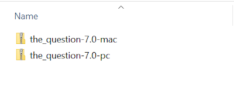

# Chapter 8: Building

- [Chapter 8: Building](#chapter-8-building)
  - [Build for Windows, MacOS X, and Linux](#build-for-windows-macos-x-and-linux)
  - [Build for Web](#build-for-web)

---

> **Note:** This chapter **will not** cover building for Android or iOS. Windows 10 requires the Java JDK, which itself requires an Oracle Account. Ren'Py also cannot build iOS projects on Windows. This is not an issue with Windows, but with how Apple handles iOS development permissions.

## Build for Windows, MacOS X, and Linux

Once a project has been finished or is at a point where play-testing can begin, Ren'Py can help build the project for release on Windows, Mac, and Linux systems.

Open the Ren'Py Launcher. Select *The Question*.

Click on "Build Distributions" under Actions.

By default, Ren'Py will select both Windows (when run on Windows) and Macintosh x86_64. Leave these options alone for now.

Click "Build".

Ren'Py will scan, process, and then build the project based on the build packages selected in the previous options.

Once finished, the Ren'Py Launcher will open a folder containing the files.

> **Note:** The above screenshot was taken on a Windows system. Other operating systems or versions may appear differently.

The Windows build, once extracted, can be run through clicking on the `the_question.exe` file to start it.

When run, the visual novel will look the same as when it was tested using "Launch Project" from the Ren'Py Launcher.

> **Note:** The build package for MacOS X is designed for that system and should not be extracted on Windows systems.

## Build for Web

Return to the Ren'Py Launcher. Click on "Web (Beta)" under Actions.

The additional package RenPyWeb is needed. Click "Yes" to allow this.

An update will be downloaded. Ren'Py will need to be restarted.

Once Ren'Py has restarted, click on "Web (Beta)" for a second time.

As the right-hand side of the screen will remind, the entire web application will need to be downloaded before the story can be run. With large images, audio files, and other resources, this can created framerate issues as it is downloaded and loading.

Click "Build Web Application".

This will scan and build the application for the web.

Once finished, click on "Open build directory".

> **Note:** Because of browser security issues, Ren'Py Web builds will often not run correctly directly from a file in a web browser. To work within these issues, it is recommended to serve the files using web server software.
