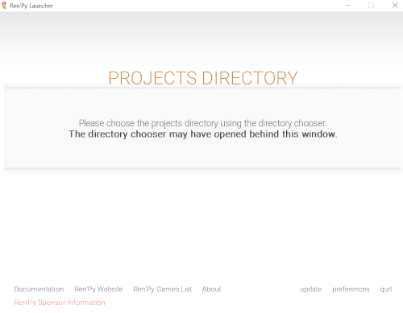
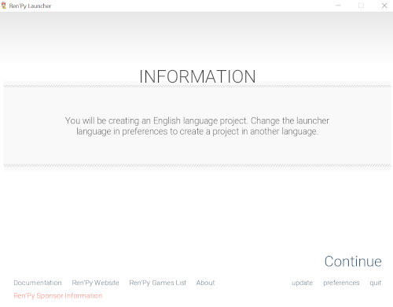
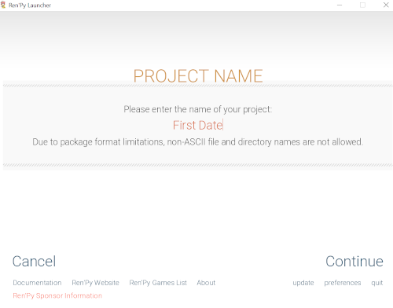
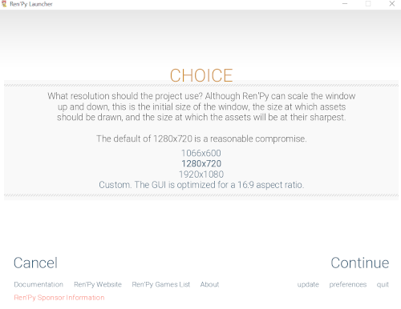
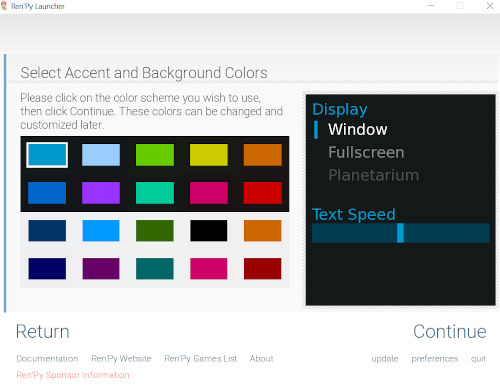
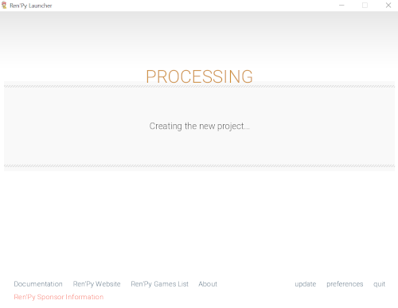
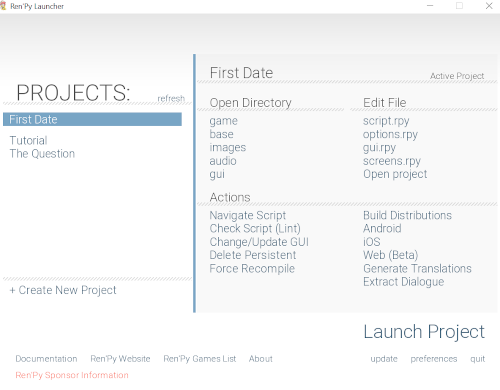
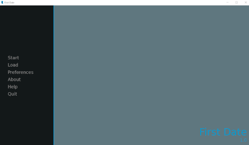
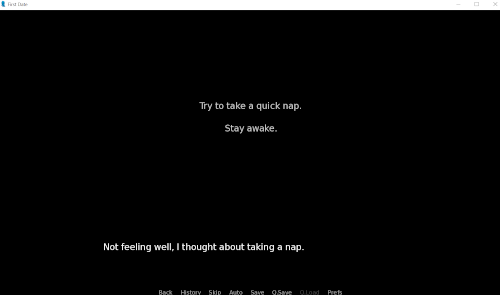
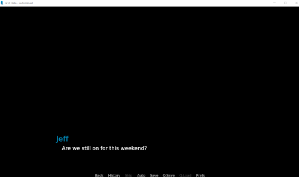

# Example: First Date

- [Example: First Date](#example-first-date)
  - [Creating a New Project](#creating-a-new-project)
  - [Outlining a Story](#outlining-a-story)
    - [Reviewing Concepts](#reviewing-concepts)
    - [Listing Scenes](#listing-scenes)
    - [Listing Characters](#listing-characters)
  - [Planning Narration and Dialogue](#planning-narration-and-dialogue)
  - [Organizing Labels](#organizing-labels)
    - [Bad Path](#bad-path)
    - [Good Path](#good-path)
    - [Current Code](#current-code)
  - [Playtesting](#playtesting)
    - [Identifying Problems](#identifying-problems)
  - [Complete Example](#complete-example)

---

## Creating a New Project

Open the Ren'Py Launcher.

Click on "+Create New Project".



Select the directory to save the project.



Ren'Py will remind of the language selected based on Preferences.



For the project name, use "First Date".



Ren'Py projects can be created with different resolutions. The default is 1280x720, which is a good resolution for most projects.



There are different color accents that can be chosen when creating a new project. For now, click "Continue" to use the default one.



Ren'Py will then create the new project.



Once created, the new project will appear under the PROJECTS listing in the Ren'Py Launcher.

## Outlining a Story

Before writing any code, a common practice is to *outline the story*. This helps in understanding who all the characters are, their motivations, and possible paths through the story. If there will be more than one ending, they can also be mapped at this step.

For this first example, the existing concepts learned in the previous chapters will also be reviewed to help in understanding how to plan a visual novel.

### Reviewing Concepts

Visual novels are broken up into scenes. These are combinations of images and text. Internally, Ren'Py calls any lines that do not have a speaker as narration and those that do dialogue. In telling the story, these two tools, narration and dialogue, need to be taken into account.

When writing code, scenes are further broken up into labels for different sections of the story where a choice menu might direct (jump to) those parts. If there will be any choices, different labels will need to be created for path within the story.

Additionally, although not part of this examples, scenes need to be broken down into what background images are needed. This same work would then need to be applied to all characters. If they will show different emotions, an image per reaction would be needed.

For this first example, **no images will be used**. This will make planning much easier and work more towards the *novel* part of visual novel for this first example.

### Listing Scenes

Visual novels are broken into scenes. Therefore, the first step should be to organize the planning into the important scenes for the story.

This story will be about the first date between two people. It will start with one character, move through choices they make to prepare for the date, and then move to the beginning of the date itself.

Based on what is known, three possible scenes might be needed:

- Explaining the story
- Preparing for the date
- Starting the date

*The Question* started with a few lines of narration that established what was happening in the visual novel before it introduced another character. This is a good model, and it helps a player to understand the context of the story before any other pieces of information.

The visual novel will begin with the label `start`, so the first scene from the list might not be needed. Instead, it can be assumed and the story focused more on the scenes of preparation and then the start of the date.

### Listing Characters

Along the scenes, the different characters of the story need to be listed. Who is part of the story?

When looking at the code of *The Question*, the characters were created at the top of the file and before the script of the story.

For this story, there are two characters. There is the protagonist and their date.

Like *The Question*, the second "character" can be named "Me". The name of the first character can be "Jeff".

The characters, then, are:

- Jeff
- Me

## Planning Narration and Dialogue

In an earlier chapter, it was noted that narration and dialogue lines should be around 30 words or less per line. In planning out narration and dialogue, this needs to be accounted for as well.

Consider the following opening line:

```Python
"We had been talking for months."
```

This is a potentially good opening. The name of the visual novel is *First Date* and this establishes that the two people have been talking to each other.

In *The Question*, there were four lines of narration to establish the scene. This is a good pattern to follow for this example as well.

Building from the existing first line, the first three narration lines might be the following:

```Python
# First scene
"We had been talking for months."

"The global pandemic had prevented us from going to any normal places, but we had made careful plans to visit a park together."

"Finally, we had arranged a date. Our first date."
```

From that point, the next scene would need to happen. In this example, there is no reason to setup a new label. The first scene would flow directly into the second one of getting ready for the date.

## Organizing Labels

There are three general scenes and two characters. The next thing to work out is what choices should happen in the story. In *The Question*, the first choice menu was the major deciding factor in which ending happened. After it, there was a second choice menu that happened within the "Good" path.

Moving into the second scene, the preparation for the date, there now needs to be a choice menu to echo the pattern found in *The Question*. In that model, the first choice menu gave information about the person the player was going to meet (originally Sylvie) and then presented options.

In this example, the deciding factor (the first choice) will concern if the player takes a nap or not. If they do, they will accidentally sleep through date. If they stay awake, they will make it on time.

```Python
# First scene
"We had been talking for months."

"The global pandemic had prevented us from going to any normal places, but we had made careful plans to visit a park together."

"Finally, we had arranged a date. Our first date."

# Second scene
"We first met when we had a course together and he always impressed me with his knowledge."

"Throughout the course, we talked with each other and continued after it ended."

"As the day went on, I was getting nervous. We had not seen each other in months."

menu:
  "Not feeling well, I thought about taking a nap."

  "Try to take a quick nap.":

  "Stay awake.":

```

In the above code, there would be two options within the choice menu:

- "Try to take a quick nap."
- "Stay awake."

Because these will provide different paths in the visual novel, there now also needs to be two new labels. The `jump` keyword also needs to be used under each option in the choice menu. For planning purposes, these can be `sleep` and `awake`.

```Python
# First scene
"We had been talking for months."

"The global pandemic had prevented us from going to any normal places, but we had made careful plans to visit a park together."

"Finally, we had arranged a date. Our first date."

# Second scene
"We first met when we had a course together and he always impressed me with his knowledge."

"Throughout the course, we talked with each other and continued after it ended."

"As the day went on, I was getting nervous. We had not seen each other in months."

menu:
  "Not feeling well, I thought about taking a nap."

  "Try to take a quick nap.":

    jump sleep

  "Stay awake.":

    jump awake

label sleep:


label awake:
```

As the paths of "sleep" and "awake" will be the main paths of the story, the keyword `return` needs to be used at the end of each to end the visual novel. For spacing, the `label start` can also now be added.

```Python
label start:

  # First scene
  "We had been talking for months."

  "The global pandemic had prevented us from going to any normal places, but we had made careful plans to visit a park together."

  "Finally, we had arranged a date. Our first date."

  # Second scene
  "We first met when we had a course together and he always impressed me with his knowledge."

  "Throughout the course, we talked with each other and continued after it ended."

  "As the day went on, I was getting nervous. We had not seen each other in months."

  menu:
    "Not feeling well, I thought about taking a nap."

    "Try to take a quick nap.":

      jump sleep

    "Stay awake.":

      jump awake

label sleep:

  return

label awake:

  return
```

### Bad Path

In *The Question*, the "Bad" path ends in four lines of narration. As the "Bad" path of this example is the "sleep" one, it can also use a few lines of narration.

```Python
label sleep:

  "I woke up suddenly and looked at my clock."

  "I accidentally slept through the date!"

  "I look at my phone and saw multiple missed calls."

  "Feeling bad, I got out of bed and picked up my phone."

  "I had ruined our first date."

  return
```

### Good Path

In *The Question*, the "Good" path also included a second choice menu. This pattern will also be used in this example as well. This second menu will include choices around the actions in the park.

```Python
label awake:

  "I stayed awake and continued to get ready."

  # Third scene
  "Soon, it was time for the date."

  "After parking, we walked around together."

  menu:

    "We were starting to get thirsty."

    "Did we stop for tea?"

    "We stopped for tea.":

    "The walk was enough.":

  return
```

For simplicity, each option of the second choice menu will "jump" to the same label. (Generally, choices in a visual novel should have some meaning to the player, but in this example they will not.)

```Python
label awake:

  "I stayed awake and continued to get ready."

  # Third scene
  "Soon, it was time for the date."

  "After parking, we walked around together."

  menu:

    "We were starting to get thirsty."

    "Did we stop for tea?"

    "We stopped for tea.":

      jump walk

    "The walk was enough.":

      jump walk

label walk:

  "We spent some time in the park."

  "We talked the whole time."

  "We had a great first date."

return
```

In the new code, the `return` keyword was moved into the new label. The "Good" path no longer ends there but in the new label of `walk`.

### Current Code

Putting in the characters at the top of the file, the current code looks like the following:

```Python
# The script of the game goes in this file.

# Declare characters used by this game. The color argument colorizes the
# name of the character.

define j = Character("Jeff")
define m = Character("Me")

# The game starts here.

label start:

  # First scene
  "We had been talking for months."

  "The global pandemic had prevented us from going to any normal places, but we had made careful plans to visit a park together."

  "Finally, we had arranged a date. Our first date."

  # Second scene
  "We first met when we had a course together and he always impressed me with his knowledge."

  "Throughout the course, we talked with each other and continued after it ended."

  "As the day went on, I was getting nervous. We had not seen each other in months."

  menu:
    "Not feeling well, I thought about taking a nap."

    "Try to take a quick nap.":

      jump sleep

    "Stay awake.":

      jump awake

label sleep:

  "I woke up suddenly and looked at my clock."

  "I accidentally slept through the date!"

  "I look at my phone and saw multiple missed calls."

  "Feeling bad, I got out of bed and picked up my phone."

  "I had ruined our first date."

  return

label awake:

  "I stayed awake and continued to get ready."

  # Third scene
  "Soon, it was time for the date."

  "After parking, we walked around together."

  menu:

    "We were starting to get thirsty."

    "Did we stop for tea?"

    "We stopped for tea.":

      jump walk

    "The walk was enough.":

      jump walk

label walk:

  "We spent some time in the park."

  "We talked the whole time."

  "We had a great first date."

  return
```

## Playtesting

In the Ren'Py Launcher, make sure *First Date* is selected.

Click on "script.rpy" under Edit File. This will open it in Atom.

Select the current text. Delete it.

Replace it with the code developed in this chapter. It is the following:

```Python
# The script of the game goes in this file.

# Declare characters used by this game. The color argument colorizes the
# name of the character.

define j = Character("Jeff")
define m = Character("Me")

# The game starts here.

label start:

  # First scene
  "We had been talking for months."

  "The global pandemic had prevented us from going to any normal places, but we had made careful plans to visit a park together."

  "Finally, we had arranged a date. Our first date."

  # Second scene
  "We first met when we had a course together and he always impressed me with his knowledge."

  "Throughout the course, we talked with each other and continued after it ended."

  "As the day went on, I was getting nervous. We had not seen each other in months."

  menu:
    "Not feeling well, I thought about taking a nap."

    "Try to take a quick nap.":

      jump sleep

    "Stay awake.":

      jump awake

label sleep:

  "I woke up suddenly and looked at my clock."

  "I accidentally slept through the date!"

  "I look at my phone and saw multiple missed calls."

  "Feeling bad, I got out of bed and picked up my phone."

  "I had ruined our first date."

  return

label awake:

  "I stayed awake and continued to get ready."

  # Third scene
  "Soon, it was time for the date."

  "After parking, we walked around together."

  menu:

    "We were starting to get thirsty."

    "Did we stop for tea?"

    "We stopped for tea.":

      jump walk

    "The walk was enough.":

      jump walk

label walk:

  "We spent some time in the park."

  "We talked the whole time."

  "We had a great first date."

  return
```

Save the file through either File -> Save or keyword shortcuts of CTRL+S (in Windows) or CMD+S (on MacOS X).

In the Ren'Py Launcher, click on "Launch Project". This will start *First Date*.



Click on "Start".

Progress the visual novel until the first choice.



Choose "Try to take a quick nap."

Progress the visual novel until it ends and resets to the Main Menu.

### Identifying Problems

There is a problem with this visual novel! It has two characters, Jeff and Me, but neither of them speak during the whole story. Instead, the entire story is delivered via narration lines. It needs some dialogue!

To fix this, some initial dialogue could be added in the first scene.

```Python
label start:

  # First scene

  "My phone buzzed."

  "I checked my messages and saw a new one from Jeff."

  j "Are we still on for this weekend?"

  "I paused and wrote a reply."

  m "Absolutely! Looking forward to it!"

  "We had been talking for months."

  "The global pandemic had prevented us from going to any normal places, but we had made careful plans to visit a park together."

  "Finally, we had arranged a date. Our first date."
```

Some additional dialogue could be added in third scene as well.

```Python
label awake:

  "I stayed awake and continued to get ready."

  # Third scene
  "Soon, it was time for the date."

  "After parking, we walked around together."

  j "It's great to see you!"

  m "I can't wait to show you this park!"

  menu:

    "We were starting to get thirsty."

    "Did we stop for tea?"

    "We stopped for tea.":

      jump walk

    "The walk was enough.":

      jump walk
```

Make the above adjustments in the "script.rpy" file and save the file.

If *First Date* is running, press SHIFT+R to reload the script. If closed, re-launch the project.

When progressing the visual novel, there will now be earlier dialogue in the story.



## Complete Example

```Python
# The script of the game goes in this file.

# Declare characters used by this game. The color argument colorizes the
# name of the character.

define j = Character("Jeff")
define m = Character("Me")

# The game starts here.

label start:

  # First scene

  "My phone buzzed."

  "I checked my messages and saw a new one from Jeff."

  j "Are we still on for this weekend?"

  "I paused and wrote a reply."

  m "Absolutely! Looking forward to it!"

  "We had been talking for months."

  "The global pandemic had prevented us from going to any normal places, but we had made careful plans to visit a park together."

  "Finally, we had arranged a date. Our first date."

  # Second scene
  "We first met when we had a course together and he always impressed me with his knowledge."

  "Throughout the course, we talked with each other and continued after it ended."

  "As the day went on, I was getting nervous. We had not seen each other in months."

  menu:
    "Not feeling well, I thought about taking a nap."

    "Try to take a quick nap.":

      jump sleep

    "Stay awake.":

      jump awake

label sleep:

  "I woke up suddenly and looked at my clock."

  "I accidentally slept through the date!"

  "I look at my phone and saw multiple missed calls."

  "Feeling bad, I got out of bed and picked up my phone."

  "I had ruined our first date."

  return

label awake:

  "I stayed awake and continued to get ready."

  # Third scene
  "Soon, it was time for the date."

  "After parking, we walked around together."

  j "It's great to see you!"

  m "I can't wait to show you this park!"

  menu:

    "We were starting to get thirsty."

    "Did we stop for tea?"

    "We stopped for tea.":

      jump walk

    "The walk was enough.":

      jump walk

label walk:

  "We spent some time in the park."

  "We talked the whole time."

  "We had a great first date."

  return
```
